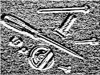

# Matlab-Proj
* Many of these projects were made in [Octave](https://www.gnu.org/software/octave/) which is an opensource version of MATLAB. For the most part if it can be done in Octave it is compatible with MATLAB.

## This Respository Includes: 

### .M files for Computer Vision Fundamentals & Image Processing 
Survey of some principles covered in course covered by R.I.T  [Digital Image Processing ECSE-4540](https://www.youtube.com/watch?v=UhDlL-tLT2U&list=PLuh62Q4Sv7BUf60vkjePfcOQc8sHxmnDX)  [Computer Vision CSCI512](https://www.youtube.com/watch?v=skaQfPQFSyY&list=PL7v9EfkjLswLfjcI-qia-Z-e3ntl9l6vp).  This link goes to a udemy course by Georgia Tech [Computational photography CS6475](https://www.youtube.com/watch?v=45gqr8e6WG4&list=PLAwxTw4SYaPn-unAWtRMleY4peSe4OzIY) which is fairly useful course especially for the use in designing applications which would use visual processing from a typical cellphone camera for measurement and photo reconstruction. Construction of some homework assignements based on lecture notes at Colorado School of Mines course on [Multidimensional Signal Processing  CSCI 510/EENG 510 ](http://inside.mines.edu/~whoff/courses/EENG510/).  Supplementing some of concepts were taken from Harvey Mudds [Neuroscience](http://fourier.eng.hmc.edu/e180/lectures/) course on the human visual system which bridges the understanding between human perception the precepts which form the foundations in compuer vision today. For 3D dimensional modeling and depth perception also known as Steriopsis [E180](http://fourier.eng.hmc.edu/e180/lectures/depth/node1.html). An additional find to supplment this is their handbook on computer vision [Computer Vision Handbook](https://www.cs.hmc.edu/~fleck/computer-vision-handbook/index.html) 

#### Major projects 

    

### .JPEG .gif and other image formats for use in templates and  Test patterns
 Some of the sample images were taken from this CSM  course titled [Multidimensional Signal Processing  CSCI 510/EENG 510 ](http://inside.mines.edu/~whoff/courses/EENG510/).  Other experiments and homework examples were take from this site [Image Processing Learning Examples](https://homepages.inf.ed.ac.uk/rbf/HIPR2/hipr_top.htm)
 
 
 

### .M files for  concrete uses of 1D Signal processing 
Signal processing for use financial signals using Matlab to smooth out noisy signals, cross correlation, autocorrelation and the like. The essentials for signal conditioning and reconstruction.  [MATLAB for Begineers for Quant Finance / Financial Engineering](https://www.youtube.com/watch?v=TClFZ9V4s1w&list=PL_-KSXJS5pxMPrnEN_YmYkDHQuNGR8uiU&index=3) Tutorial uses of MATLAB taken at University of Minnesota Duluth in person [EE 2111](http://www.d.umn.edu/~ihayee/Teaching/ee2111/ee2111.htm). [Error correcting codes](http://www.eccpage.com) and signal denoising.

### .M files for Control Theory 

### .PDFs of Reports including useage for the .M
This additional documentation adds context for the purpose of .M 

### .Mex files how to link C++ code with .M files 
[How to build .Mex files](https://www.mathworks.com/help/matlab/matlab_external/build-an-executable-mex-file.html)

